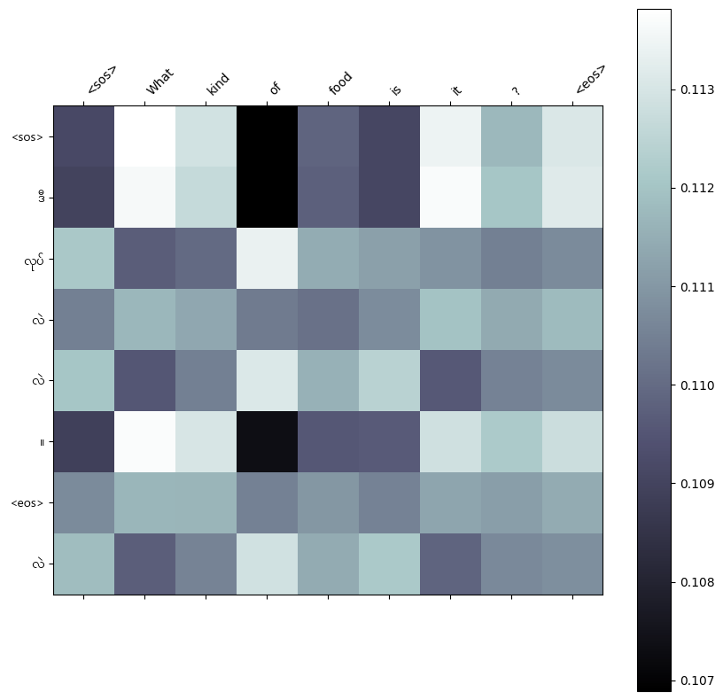

# NLP A3
 AIT NLP Assignment 3

- [Student Information](#student-information)
- [Installation and Setup](#installation-and-setup)
- [Usage](#usage)
- [Training Data](#training-data)
- [Preprocessing Data](#preprocessing-data)
- [Attention Mechanism Comparison](#attention-mechanism-comparison)
- [Loss Graph](#loss-graph)
- [Attention Map](#attention-map)
- [Relation between Burmese and Additive Attention](#relation-between-burmese-and-additive-attention)
- [Web application and model interface](#web-application-and-model-interface)


## Student Information
Name - Min Marn Ko 
ID - st125437

## Installation and Setup
Streamlit Web at localhost:8501

## Usage
How It Works
🔹 Type one or more English words into the input box.
🔹 Click the "Submit" button.
🔹 Instantly see the translated text in Burmese (Myanmar)!

## Training Data
Corpus source - TUFS Asian Language Parallel Corpus (TALPCo) (https://github.com/matbahasa/TALPCo?fbclid=IwAR0QuArqnoLub0WDPK2FL4e6OLaWBOEShVL-LoQxeAJ_qpBnLXnZ80YVJSU)  

The `data-eng.txt` and `data-myn.txt` files from the TALPCo repository are preprocessed with Excel and converter into CSV files and uploaded to Hugging Face with `Hug_face.py` at `minmarn/data_eng_myn_2`.

Training    -   1097 rows  
Validation  -   138 rows  
Testing     -   137 rows

## Preprocessing Data
### **Tokenization Process for English and Burmese**
#### **English (Source Language)**
- Tokenized using **Torch’s `get_tokenizer`** function.

#### **Burmese (Target Language)**
- Tokenized using **Dr. Ye Kyaw Thu’s myWord segmenter** ([GitHub Repository](https://github.com/ye-kyaw-thu/myWord)).
- Burmese text does not use spaces meaningfully, as words are formed by combining syllables.
- **Step 1:** The following **regular expression** is used to split sentences into individual syllables:

```python
import re

myConsonant = r"က-အ"
enChar = r"a-zA-Z0-9"
otherChar = r"ဣဤဥဦဧဩဪဿ၌၍၏၀-၉၊။!-/:-@[-`{-~\s"
ssSymbol = r'္'
aThat = r'်'

BreakPattern = re.compile(
    r"((?<!" + ssSymbol + r")[" + myConsonant + r"](?![" + aThat + ssSymbol + r"])"
    + r"|[" + enChar + otherChar + r"])", re.UNICODE
)
```

- **Example Input Sentence (Burmese)**
```text
ဒီခေတ်ကြီးမှာ ကုဒ်တွေအရမ်းများလွန်းနေတယ် ဒါဟာ ၀မ်းနည်းစရာကောင်းပေမဲ့ မှန်ကန်တဲ့အကြောင်းအချက်ပါ။
```

- **Step 2:** **Syllable-Based Tokenization**
```python
['ဒီ','ခေတ်','ကြီး','မှာ','ကုဒ်','တွေ','အ','ရမ်း','များ','လွန်း','နေ','တယ်',
 'ဒါ','ဟာ','၀မ်း','နည်း','စ','ရာ','ကောင်း','ပေ','မဲ့','မှန်','ကန်','တဲ့','အ',
 'ကြောင်း','အ','ချက်','ပါ','။']
```

- **Step 3:** **Word-Based Tokenization**
  - Meaningful word combinations are formed by merging syllables:
```python
['ဒီ', 'ခေတ်', 'ကြီး', 'မှာ', 'ကုဒ်', 'တွေ', 'အရမ်း', 'များ', 'လွန်း', 'နေ', 'တယ်',
 'ဒါ', 'ဟာ', '၀မ်း', 'နည်း', 'စရာ', 'ကောင်း', 'ပေမဲ့', 'မှန်ကန်', 'တဲ့', 'အကြောင်းအချက်',
 'ပါ', '။']
```

---

### **Building the Vocabulary and DataLoader**
- **Vocabulary Construction:**  
  - The **tokenized corpus** is used to build a **vocabulary**, including only tokens that appear at least **twice** (minimum frequency threshold = 2).
  
- **Transformations for Model Training:**  
  1. **Corpus Processing** → Tokenized text is stored.  
  2. **Vocabulary Transformation** → Maps words to indices.  
  3. **Tensor Transformation** → Converts sequences into tensors.  
  4. **Collate Function (Padding)** → Ensures uniform input length for batching.

- **Final Step:**  
  - The **DataLoader** is constructed, incorporating these transformations for efficient training.

## Training Process
Epochs - 10 (small training data)
Hidden dimension - 256  
Feedforward dimension - 512  
Number of encoder/decoder layers - 3  
Number of heads for multihead attention - 8  
Dropout rate - 0.1  

## Attention Mechanism Comparison

| Attentions       | Training Loss | Training PPL | Validation Loss | Validation PPL |
|------------------|---------------|--------------|-----------------|----------------|
| General       |        2.541          |       12.688        |      3.216         |        24.937         |
| Multiplicative|         3.068          |       21.490        |       2.169        |         8.750        |
| Additive      |        3.027           |      20.636        |       2.363         |          10.623       |

The **additive attention mechanism** demonstrated slightly better performance compared to the other two attention mechanisms. The reasoning behind this and its implications will be discussed in **[Relation between Burmese and Additive Attention](#relation-between-burmese-and-additive-attention)**.

### **Computational Efficiency**
The execution times for each attention mechanism were as follows:
- **General Attention**: **2m 23s**  
- **Multiplicative Attention**: **2m 28s**  
- **Additive Attention**: **2m 35s**  

Since the differences in runtime are minimal, we can conclude that **all three models are nearly identical in terms of computational efficiency**.

### **Translation Accuracy**
Despite their comparable efficiency, all three mechanisms **struggle with translation accuracy**. Due to the **lack of a clear benchmark** for Myanmar language translation, the additive attention mechanism was selected **based on validation loss and perplexity**.

## Loss Graph
| General Attention Loss                                     | Multiplicative Attention Loss                                      | Additive Attention Loss                                       |
|----------------------------------------------|----------------------------------------------|----------------------------------------------|
|  |  |  |
 

## Attention Map
| General Attention Map                                     | Multiplicative Attention Map                                      | Additive Attention Map                                       |
|----------------------------------------------|----------------------------------------------|----------------------------------------------|
|  |  |  | 

## Relation between Burmese and Additive Attention
The **complex token dependencies** in the Burmese language, along with the intricate cross-lingual relationships between Burmese phrases and English words, likely contribute to the **slight performance advantage** of the additive attention model over the other two models. The **additional trainable parameters** in the additive attention mechanism allow the model to **better capture these complex relationships**, making it more effective for Burmese-English translation.

## Web application and model interface
The web application **loads the model** and processes the **user input** as the source text. The translation process follows a **greedy decoding** approach:

1. **Initialization**:  
   - The user input is taken as the **source sequence**.  
   - The target sequence is initialized with the **`<sos>` (start-of-sequence) token**.

2. **Greedy Decoding Process**:  
   - The model **predicts the next word** based on the current source and target sequence.  
   - The predicted word is **appended to the target sequence**.  
   - This process **repeats iteratively** until one of the following conditions is met:  
     - The **maximum sequence length** is reached.  
     - The model predicts the **`<eos>` (end-of-sequence) token**.

3. **Output Generation**:  
   - The predicted words in the **target sequence** are **joined together**.  
   - The final translated text is **displayed to the user**.